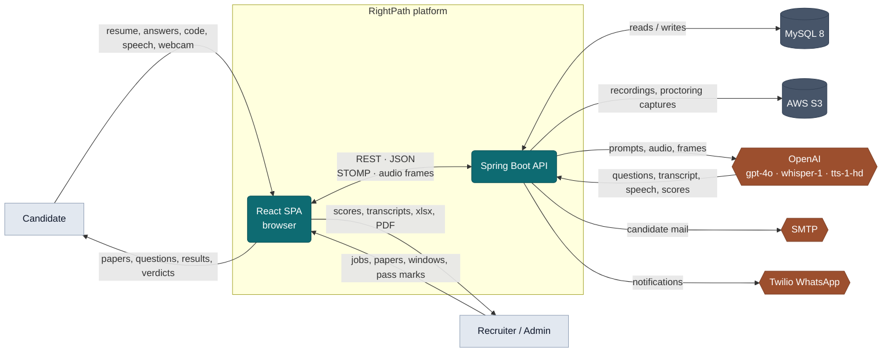
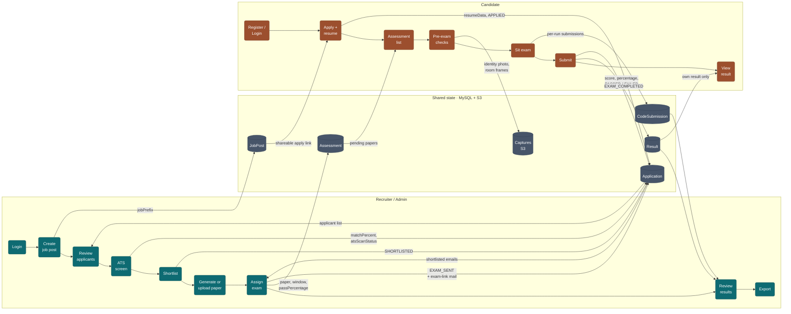
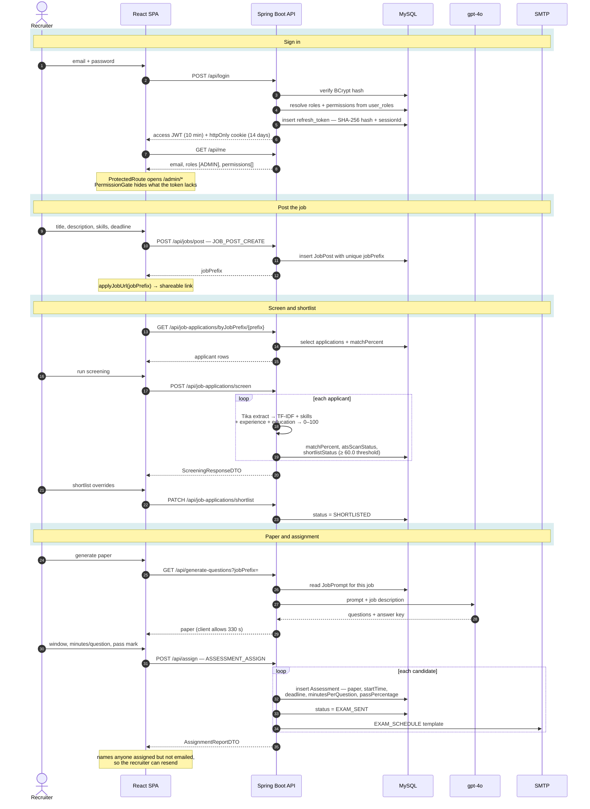
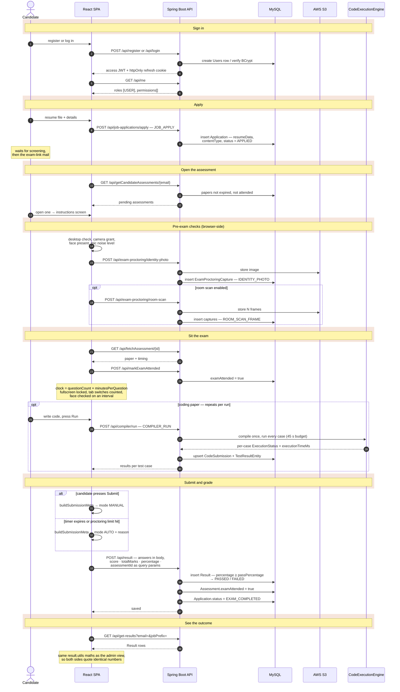
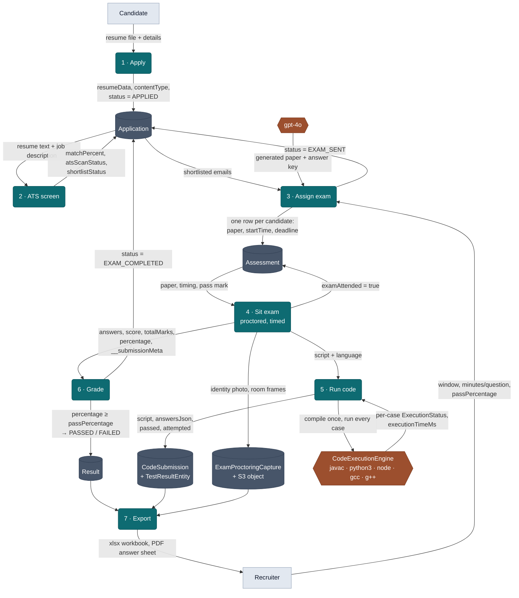
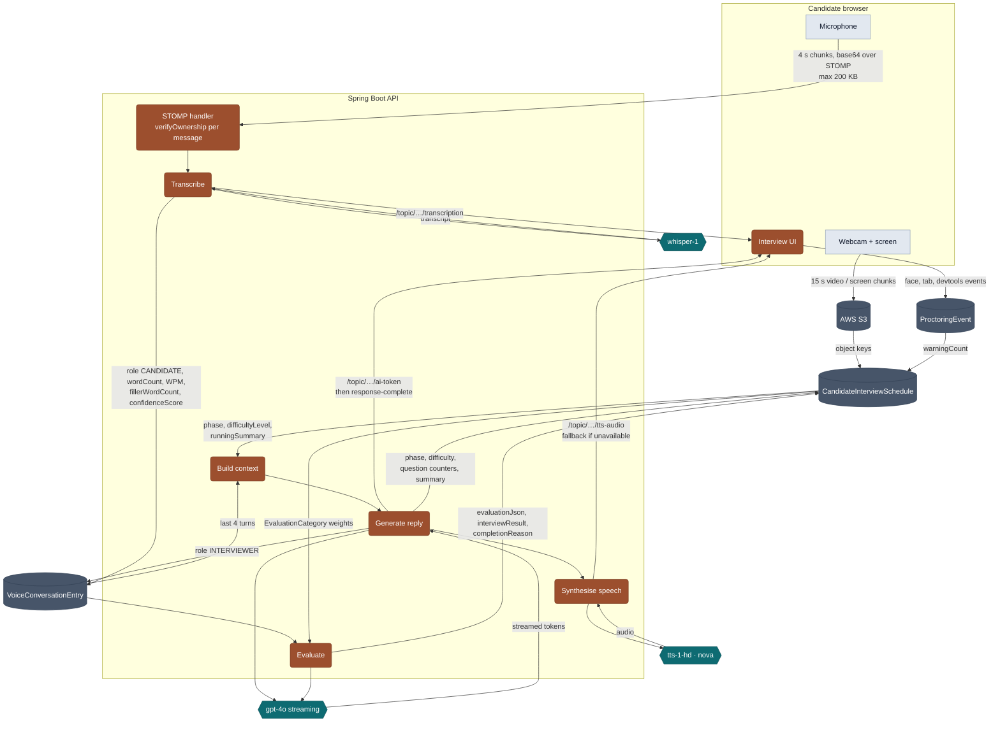
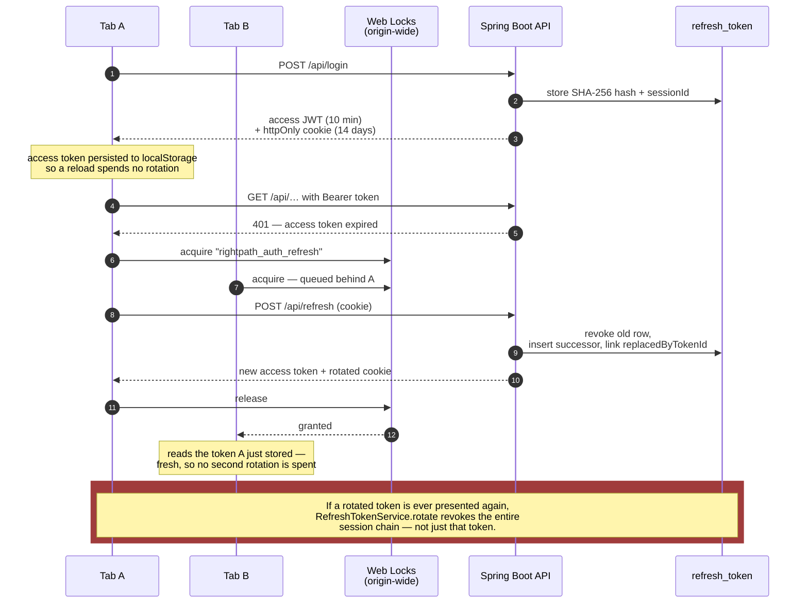
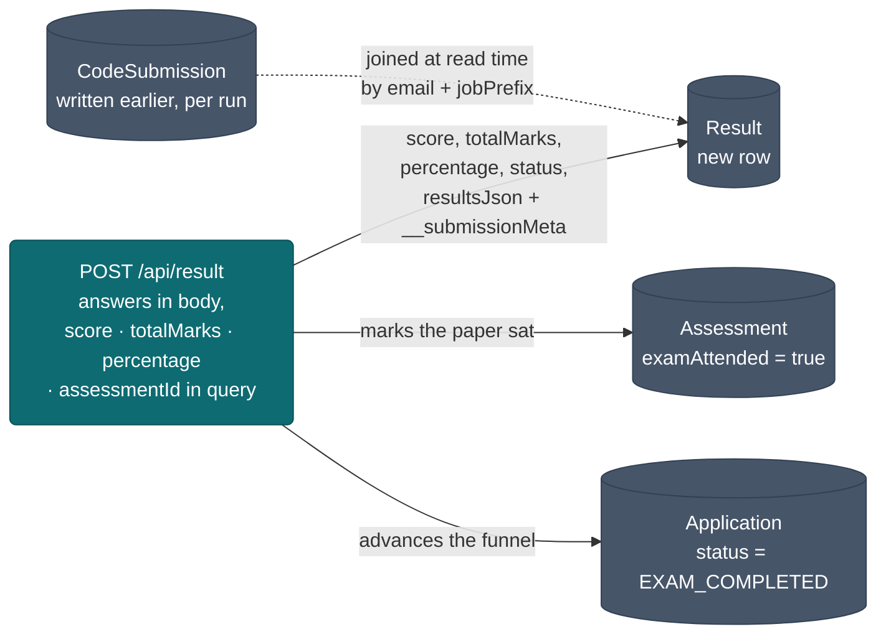

# AIRightpath — Data Flow

Where data enters the platform, what transforms it, which store it lands in, and
what leaves. Eight diagrams, from the system boundary down to the two tracks and
the token exchange that guards them.

**Looking for the whole journey?** [Section 2](#2--end-to-end--login-to-assessment-complete)
traces login through to a graded result, from both the recruiter's side and the
candidate's, naming every endpoint on the way.

Companion to [AIRightpath-Technical-Reference.md](AIRightpath-Technical-Reference.md).
Every flow here was read out of the code; edge labels name the actual fields
written, not a paraphrase.

## Reading the diagrams

| Shape | Means |
| --- | --- |
| Rectangle | **External actor** — a person outside the system |
| Rounded box | **Process** — code that transforms data |
| Cylinder | **Data store** — a MySQL table or an object-storage bucket |
| Hexagon | **External service** — a third party the platform calls out to |

Arrows carry the data, not just a relationship: read the label to see what
actually moves. Teal marks the **L1 assessment** track, clay marks **L2
interview**, grey is shared infrastructure.

---

## 1 · Context — the system boundary

What crosses the edge of the platform. Two kinds of user put data in, five
external services are called out to, and everything durable lands in MySQL or S3.

**The one thing to notice:** the browser is not a thin client. Proctoring
decisions — face checks, tab counting, the exam clock, auto-submit — are made in
the SPA and only their *outcome* is posted to the API. The server enforces
windows, grading and interview timeouts; the browser enforces conduct.

---

## 2 · End to end — login to assessment complete

The full arc, both actors, in the order it actually happens. Three views of the
same journey: who does what and where it lands (2.1), then every call the
recruiter makes (2.2) and every call the candidate makes (2.3).

### 2.1 · Both lanes, start to finish

The handoffs are the interesting part. Neither actor ever talks to the other —
they only meet in the shared stores, which is why a stale `Application` row is
the usual cause of "the candidate says they never got the exam".

### 2.2 · Recruiter — login to exam assigned

Every call, in order, with the authority each one requires and what it writes.

### 2.3 · Candidate — login to result

The same journey from the other side. Note where the browser acts alone: the
proctoring loop never round-trips, only its outcome does.

**Four details worth carrying out of this section:**

- **Login is two calls, not one.** `POST /api/login` mints the tokens;
  `GET /api/me` is what supplies roles and permissions. On a reload there is a
  third path — `AuthProvider` refreshes first, *then* calls `/me`, so routes
  never evaluate against an empty permission list.
- **The exam clock is derived at load, not stored.** `questionCount ×
  minutesPerQuestion`, with the assignment's override winning. Nothing on the
  server counts down; the browser owns the clock and the server owns the window.
- **`assessmentId` on submit is not optional in practice.** A re-assigned exam
  leaves several rows of the same type for one candidate, and only the id says
  which attempt this result belongs to.
- **Coding submissions are written during the exam, not at submit.** Every Run
  upserts. If a candidate never presses Submit, the code is still there — which
  is what makes an auto-submitted or abandoned attempt reviewable.

---

## 3 · L1 — assessment data flow

From a resume arriving to a graded result leaving as a workbook. Seven
processes, five stores.

**Three things the diagram makes visible that prose hides:**

- **The `Application` row is written by four different processes.** Apply, ATS
  screen, Assign and Grade each move it forward. That is why the status enum and
  the per-stage string flags have to be kept in step by
  `StatusTransitionValidator` — four writers, one ladder.
- **`percentage` travels with `score`, not instead of it.** The exam page
  computes the percentage and sends both; grading compares the percentage
  against `passPercentage`. Grading raw marks failed papers that had passed.
- **Code execution is a side loop, not a stage.** A candidate can run code many
  times; only the submission is stored. The exam clock keeps running throughout.

---

## 4 · L2 — interview data flow

The realtime loop, one turn of conversation. Audio in on the left, speech out on
the right, with three stores accumulating the record as it goes.

**What the loop turns on:**

- **`runningSummary` is the reason this scales.** Only the last four turns plus a
  rolling summary go to the model. Without it, every turn would resend the whole
  interview and the context window would decide when the interview ends.
- **`CandidateInterviewSchedule` is both input and output of the same turn.** It
  supplies phase and difficulty, then is written back with the updated ones.
  That feedback edge is the adaptive difficulty.
- **Every inbound message re-checks ownership.** The handshake authenticates
  once; `verifyOwnership` runs per message, so a socket cannot be steered at
  another candidate's `scheduleId` after connecting.

---

## 5 · Authentication — the token exchange

Not a data flow so much as a data *hazard*: the server treats a reused refresh
token as theft and revokes the whole session, so the client must never spend the
cookie twice. This is what stops two tabs doing exactly that.

**Why the lock exists at all.** Three separate mechanisms could each spend a
rotation: the startup bootstrap, the 401 retry path, and a second tab waking up.
Under React StrictMode the bootstrap alone ran twice. The single-flight promise
serialises the first two; the Web Locks lock is origin-wide and serialises the
third. Persisting the access token removes the need for most refreshes in the
first place.

---

## 6 · What one exam submission writes

The narrowest useful view: a candidate presses Submit once, and four rows change
across three tables. Worth having when debugging a result that looks wrong.

**The dashed edge is the subtle one.** Coding submissions are written during the
exam, one per run, and are *not* referenced by the `Result` row. The results
screen joins them at read time on email plus `jobPrefix`. That is why a
re-assigned exam needs `assessmentId` passed explicitly on submit — several rows
of the same type exist, and only the id says which attempt this result belongs
to.

---

## Keeping this current

| If you changed… | Update |
| --- | --- |
| A new external service, or one removed | Section 1 |
| The order of calls on login, apply, assign or exam entry | Section 2 — all three views |
| An L1 stage, or what a stage writes | Sections 2 and 3 |
| The interview turn, context window, or evaluation inputs | Section 4 |
| Token lifetime, rotation or the locking strategy | Sections 2.2/2.3 and 5 |
| The submit payload or what it writes | Sections 2.3 and 6 |

Edge labels name real fields. When a column is renamed, the label is wrong until
it is changed here too — that is the point of naming them rather than writing
"saves data".
